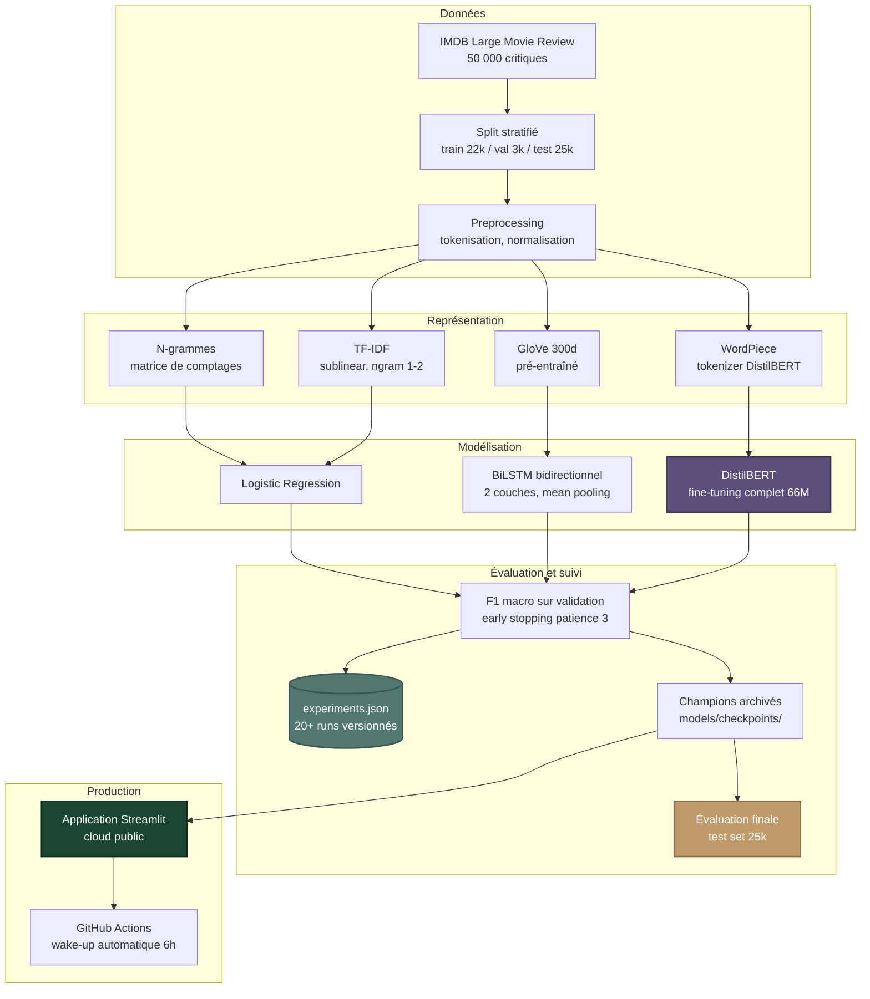

# Pipeline NLP de classification de sentiments

[](https://sandra-fogang-sentiment-imdb.streamlit.app/)
[](https://www.python.org/downloads/)
[](https://pytorch.org/)
[](https://huggingface.co/transformers/)
[](tests/)
[](https://opensource.org/licenses/MIT)

> **Mots-clés** — `NLP` · `Sentiment Analysis` · `Transformers` · `DistilBERT` · `BiLSTM` · `TF-IDF` · `GloVe` · `Fine-tuning` · `PyTorch` · `Hugging Face` · `scikit-learn` · `Streamlit` · `MLOps`

Étude comparative de quatre paradigmes NLP — du sac de mots aux transformers —
appliquée à la classification binaire de sentiments sur critiques de films IMDB.
Le projet couvre l'ensemble de la chaîne de valeur : exploration, entraînement,
suivi versionné des expériences, archivage des modèles, évaluation finale sur
test set, et déploiement web fonctionnel.

**Modèle champion** : DistilBERT fine-tuné de bout en bout —
**F1 macro = 92.62 %** sur le test set IMDB officiel (25 000 critiques jamais
vues durant le développement).

---

## Démonstration en ligne

L'application Streamlit interactive permet de tester en direct le modèle de
production (TF-IDF, choisi pour sa rapidité d'inférence) :

**[https://sandra-fogang-sentiment-imdb.streamlit.app/](https://sandra-fogang-sentiment-imdb.streamlit.app/)**

L'application propose :
- Six exemples pré-chargés couvrant des cas clairs, nuancés et difficiles
  (sarcasme, ambivalence)
- Un champ de saisie libre pour vos propres critiques
- Une documentation technique complète avec model card

---

## Table des matières

- [Aperçu et résultats clés](#aperçu-et-résultats-clés)
- [Architecture du pipeline](#architecture-du-pipeline)
- [Données](#données)
- [Comparaison des modèles (validation)](#comparaison-des-modèles-validation)
- [Évaluation finale sur le test set](#évaluation-finale-sur-le-test-set)
- [Pipeline détaillé](#pipeline-détaillé)
- [Choix du modèle de production](#choix-du-modèle-de-production)
- [Apprentissages techniques](#apprentissages-techniques)
- [Limitations et model card](#limitations-et-model-card)
- [Reproductibilité](#reproductibilité)
- [Stack technique](#stack-technique)
- [Améliorations futures](#améliorations-futures)
- [Auteure](#auteure)

---

## Aperçu et résultats clés

Quatre familles de modèles ont été comparées sur la même tâche, avec une
méthodologie unifiée (mêmes splits, mêmes graines aléatoires, même critère de
sélection F1 macro) :

1. **N-grammes pondérés par occurrence** — régression logistique sur unigrammes
   et bigrammes
2. **TF-IDF** — régression logistique sur features pondérées avec `sublinear_tf`
3. **BiLSTM** — réseau récurrent bidirectionnel initialisé avec embeddings
   GloVe pré-entraînés (300 dimensions)
4. **DistilBERT** — transformer pré-entraîné, fine-tuné de bout en bout

L'ensemble des runs (~20) est versionné dans
[`outputs/experiments.json`](outputs/experiments.json). L'évaluation finale sur
le test set est consignée dans
[`outputs/test_set_results.json`](outputs/test_set_results.json).

<p align="center">
  
</p>

**Trois enseignements méthodologiques** se dégagent du projet :

- **Le fine-tuning fait toute la différence pour les transformers.** Utilisé
  comme simple extracteur de features (poids gelés, seule la tête de
  classification est entraînée), DistilBERT atteint 85.4 % de F1 — soit
  **en dessous** des modèles classiques. Fine-tuné de bout en bout, il devient
  le meilleur modèle à 93.2 % sur la validation et 92.6 % sur le test.
- **Les modèles classiques bien calibrés résistent.** TF-IDF avec unigrammes,
  bigrammes et `sublinear_tf` atteint 91.9 % de F1 — soit 1.3 point sous BERT
  sur la validation, mais avec un modèle **20 fois plus léger** et environ
  **50 fois plus rapide en inférence**.
- **Plus de paramètres ne garantit pas de meilleurs résultats.** L'ablation
  contrôlée du BiLSTM (détaillée plus bas) montre que doubler la dimension
  cachée et ajouter une seconde couche **dégrade légèrement** la performance,
  alors que changer la stratégie de pooling apporte +1.2 point sans coût
  paramétrique.

---

## Architecture du pipeline

L'architecture suit une séparation stricte des responsabilités, du chargement
des données jusqu'à la prédiction servie en production :



L'ensemble du pipeline — du téléchargement des données à la prédiction servie —
est reproductible en moins de cinq commandes (voir
[Reproductibilité](#reproductibilité)).

---

## Données

**Source** : [IMDB Large Movie Review Dataset](https://ai.stanford.edu/~amaas/data/sentiment/)
(Maas et al., 2011), corpus public de référence pour la classification de
sentiments en anglais.

| Split | Effectif | Classes (négatif / positif) | Usage |
|-------|---------:|:---------------------------:|-------|
| Entraînement | 22 000 | 11 000 / 11 000 | Apprentissage des modèles |
| Validation | 3 000 | 1 500 / 1 500 | Sélection d'hyperparamètres et early stopping |
| Test | 25 000 | 12 500 / 12 500 | Évaluation finale, intouché jusqu'à la sélection définitive |

Les classes sont parfaitement équilibrées, ce qui rend le **F1 macro** quasi
équivalent à l'accuracy dans ce contexte. Le F1 macro reste néanmoins préférable
parce qu'il deviendrait plus robuste si la distribution venait à changer en
production.

<p align="center">
  
</p>

La longueur médiane d'une critique est d'environ 175 mots. La longueur maximale
de **512 tokens** retenue (en WordPiece pour BERT, en mots pour les autres
modèles) capture intégralement environ 95 % des critiques.

---

## Comparaison des modèles (validation)

Le tableau ci-dessous résume les performances de chaque champion sur le set de
**validation** (3 000 critiques) — c'est sur cette base qu'a été conduite la
sélection d'hyperparamètres. L'évaluation indépendante sur le test set est
présentée dans la [section suivante](#évaluation-finale-sur-le-test-set).

| Modèle | Validation F1 | Validation Accuracy | Paramètres entraînables | Taille (MB) |
|--------|:-------------:|:-------------------:|:-----------------------:|:-----------:|
| Bigramme baseline (top 30k) | 0.885 | 0.885 | 30 k | 5 |
| Bigramme min_count=3 | 0.906 | 0.907 | 215 k | 12 |
| TF-IDF uni+bi sublinear | **0.919** | 0.920 | 243 k | 12 |
| BiLSTM + GloVe 300d | 0.914 | 0.914 | 10.9 M | 42 |
| DistilBERT (gelé) | 0.854 | 0.857 | 1.5 k | 250 |
| **DistilBERT (fine-tuné)** | **0.932** | **0.930** | **66.4 M** | 250 |

### Trade-off performance / coût

<p align="center">
  
</p>

Cette représentation rend visible un fait peu évident : entre 5 MB et 250 MB de
poids, on ne gagne que ~5 points de F1, et la majorité de ce gain est captée
dès **12 MB** (TF-IDF). Ce trade-off justifie le choix du modèle servi en
production.

### Impact du fine-tuning sur DistilBERT

L'écart de performance entre DistilBERT utilisé comme simple extracteur de
features (poids gelés, 1.5 k paramètres entraînables) et le même modèle
fine-tuné de bout en bout est spectaculaire :

<p align="center">
  
  
</p>

Le saut de **+7.8 points** confirme une intuition forte : un transformer
pré-entraîné encode du langage général, mais nécessite une adaptation des
poids internes pour devenir compétitif sur une tâche spécifique. Les courbes
d'entraînement à droite révèlent qu'au-delà de l'epoch 2, la train loss
continue à descendre alors que la val loss remonte — signature classique du
surapprentissage. L'early stopping (patience 3) restaure automatiquement les
meilleurs poids.

### Ablation contrôlée du BiLSTM

Cinq variantes architecturales du BiLSTM ont été testées séquentiellement pour
isoler l'effet de chaque modification :

<p align="center">
  
</p>

Trois conclusions intéressantes émergent :
- Augmenter la capacité (`hidden_dim` de 64 à 256, ajout d'une seconde couche)
  n'apporte rien en l'absence de changement plus profond
- Le passage du **dernier état caché** au **mean pooling** sur toute la séquence
  capture mieux le sens global de la critique (+1.2 point, sans nouveau paramètre)
- Charger des embeddings **GloVe 300d** plutôt que d'apprendre des embeddings
  100d depuis zéro apporte +1.1 point — la pré-entraînement linguistique paye

Cette analyse est documentée en détail dans
[`outputs/lstm_ablation_analysis.md`](outputs/lstm_ablation_analysis.md).

---

## Évaluation finale sur le test set

Une fois la sélection d'hyperparamètres figée, les deux modèles candidats au
déploiement (TF-IDF et DistilBERT fine-tuné) ont été évalués **une seule fois**
sur les 25 000 critiques du test set IMDB officiel, jamais utilisées durant
le développement.

### Résultats finaux

| Modèle | Test F1 macro | Test Accuracy | F1 (négatif) | F1 (positif) |
|--------|:-------------:|:-------------:|:------------:|:------------:|
| TF-IDF + Régression logistique | **0.9094** | 90.94 % | 0.9101 | 0.9087 |
| **DistilBERT fine-tuné** | **0.9262** | **92.63 %** | **0.9240** | **0.9285** |

### Comportement détaillé : confusion matrices

<p align="center">
  
</p>

Une observation intéressante émerge de la comparaison côte à côte :
**TF-IDF est quasi-symétrique** dans ses erreurs (1 037 faux positifs vs
1 227 faux négatifs), tandis que **DistilBERT est asymétrique** — il
sur-classifie en positif (1 309 faux positifs contre seulement 533 faux
négatifs). En pratique : BERT rate moins de critiques positives, mais signale
plus de critiques négatives à tort comme positives. Cette asymétrie est
documentée dans la [model card](#limitations-et-model-card) et représente une
piste naturelle d'amélioration via recalibration.

### Analyse de la généralisation (val → test)

<p align="center">
  
</p>

L'écart entre validation et test mesure si la sélection d'hyperparamètres a
sur-ajusté le set de validation. Pour les deux modèles, **l'écart reste sous
1 point** :

- TF-IDF : 91.92 % → 90.94 % (−0.98 pt)
- DistilBERT : 93.19 % → 92.62 % (−0.57 pt)

DistilBERT généralise légèrement mieux — un signal en faveur de la robustesse
des représentations apprises par fine-tuning.

---

## Pipeline détaillé

### 1. Chargement et split des données

- Téléchargement automatique du corpus via Hugging Face `datasets`
- Split stratifié reproductible (`RANDOM_SEED=202601`)
- Vérification systématique des proportions et de l'équilibre des classes

### 2. Préprocessing

| Modèle | Transformations |
|--------|-----------------|
| N-grammes / TF-IDF | minuscule, suppression ponctuation, tokenisation par espaces |
| BiLSTM | + construction d'un vocabulaire (top 30 k mots, min_count=5) |
| DistilBERT | tokenisation WordPiece via `AutoTokenizer` (vocabulaire pré-entraîné) |

### 3. Représentation des features

- **N-grammes** : matrice creuse de comptages
- **TF-IDF** : `TfidfVectorizer(ngram_range=(1,2), min_df=3, sublinear_tf=True)` — 243 k features
- **BiLSTM** : embeddings GloVe 6B.300d initialisés (couverture du vocabulaire 98.3 %), continués pendant l'entraînement
- **DistilBERT** : embeddings WordPiece du modèle pré-entraîné, gelés ou fine-tunés selon la stratégie

### 4. Entraînement

| Aspect | Spécifications |
|--------|---------------|
| Optimiseur | Adam |
| Learning rates | 1e-3 (TF-IDF, LSTM), 2e-5 (BERT fine-tuné), 5e-3 (BERT gelé) |
| Batch size | 32 (TF-IDF), 64 (LSTM), 16 (BERT 512 tokens sur GPU T4) |
| Loss | CrossEntropyLoss |
| Early stopping | patience 3, min_delta 1e-4 |
| Critère de sélection | F1 macro sur la validation |
| Hardware | CPU (modèles classiques), GPU T4 sur Colab (LSTM, BERT) |

### 5. Suivi des expériences

Chaque run alimente automatiquement
[`outputs/experiments.json`](outputs/experiments.json) avec hyperparamètres,
métriques et historique des pertes :

```json
{
  "name": "distilbert_full_finetune_PROD",
  "model": {"type": "distilbert_fine_tuned", "n_trainable_params": 66364418},
  "training": {"batch_size": 16, "max_epochs": 5, "learning_rate": 2e-05},
  "val_metrics": {"accuracy": 0.9303, "f1": 0.9319},
  "loss_history": {...}
}
```

Cela permet la comparaison équitable de runs effectués à plusieurs jours
d'intervalle, sur différents hardwares.

### 6. Archivage des champions

Les meilleurs modèles de chaque paradigme sont archivés localement dans
`models/checkpoints/` (le `.pt` de DistilBERT, 250 MB, n'est pas versionné
sur Git mais peut être regénéré via `train_champion_bert.py`) :

| Fichier | Modèle | Validation F1 |
|---------|--------|:-------------:|
| `bigram_mincount_3.pt` (+ `_vocab.pkl`) | n-grammes | 0.906 |
| `tfidf_uni_bi_sublinear.pt` (+ `_vectorizer.pkl`) | TF-IDF | 0.919 |
| `bilstm_v2_full_glove300.pt` (+ `_vocab.pkl`) | BiLSTM + GloVe | 0.914 |
| `distilbert_full_finetune.pt` (+ `distilbert_tokenizer/`) | DistilBERT | 0.932 |

### 7. Déploiement

L'application Streamlit charge le modèle de production
(`models/classifier.pt` = TF-IDF) avec un mécanisme de **fallback intelligent** :
si le fichier de modèle est absent au premier démarrage Streamlit Cloud, l'app
ré-entraîne automatiquement le modèle. Un workflow GitHub Actions ping
l'application toutes les 6 heures pour éviter le sleep mode du tier gratuit.

---

## Choix du modèle de production

Le modèle déployé n'est pas le plus performant en absolu, mais celui qui offre
le meilleur compromis pour le contexte de cette démonstration publique :
**TF-IDF + Régression logistique**.

| Critère | TF-IDF | DistilBERT fine-tuné |
|---------|:------:|:--------------------:|
| F1 sur le test set | 90.94 % | **92.62 %** |
| Taille du modèle | **12 MB** | 250 MB |
| Latence d'inférence (CPU) | **~10 ms** | ~500 ms |
| Mémoire au runtime | **<100 MB** | ~600 MB |
| Compatible Streamlit Cloud free | **Oui** | Non (limite 1 GB RAM) |

Le **gain de 1.68 point** apporté par BERT, bien que statistiquement
significatif, ne justifie pas un coût opérationnel ~20× supérieur dans un
contexte de démo gratuite. DistilBERT reste **archivé et prêt à servir** sur
infrastructure GPU si la performance maximale devient prioritaire.

> **Position défendable en entretien :** « Le choix du modèle dépend des
> contraintes de déploiement. BERT améliore la performance, mais TF-IDF reste
> très compétitif pour un coût bien moindre. »

---

## Apprentissages techniques

Au-delà des chiffres bruts, plusieurs principes méthodologiques se sont
confirmés au cours du projet :

- **Établir un baseline solide est non négociable.** Un bigramme bien calibré
  atteint 90.6 % — la barre que tout modèle plus complexe doit franchir
  significativement pour mériter sa complexité.
- **Tester avant d'adopter.** La régularisation L2 a été testée puis **rejetée**
  (effet dans le bruit statistique). Plutôt que de balayer ce résultat, il est
  documenté dans `experiments.json`.
- **L'ablation contrôlée révèle ce qu'on n'aurait pas deviné.** Sur le LSTM, le
  changement de stratégie de pooling apporte plus que toutes les augmentations
  de capacité réunies.
- **Le fine-tuning n'est pas un détail.** L'écart frozen / fine-tuned (85.4 →
  93.2) est plus grand que l'écart entre n'importe quels deux modèles
  classiques de l'étude.
- **L'évaluation finale sur test set est non-négociable.** Toutes les
  performances annoncées dans une présentation, un CV ou un README devraient
  toujours être les chiffres test, pas les chiffres validation. Cette discipline
  donne la mesure honnête de ce qu'un modèle fait réellement.
- **Reproductibilité = graines fixées.** Tous les runs utilisent
  `RANDOM_SEED=202601` et `TORCH_SEED=202401`, vérifiés en re-exécutant le
  champion BERT à plusieurs reprises avec des résultats identiques au quatrième
  chiffre après la virgule.

---

## Limitations et model card

### Usage prévu

Classification binaire de critiques de films **en anglais**, à des fins
éducatives ou de démonstration de pipeline NLP. **Pas adapté** à des décisions
automatisées en production sans validation humaine.

### Limitations connues

- **Langue unique** — le modèle n'a vu que de l'anglais. Sa sortie sur d'autres
  langues est essentiellement aléatoire.
- **Domaine spécifique** — performance dégradée en dehors du cinéma (produits,
  services, conversations).
- **Sarcasme et ironie** — limitation structurelle des approches sac-de-mots
  *et* des transformers entraînés uniquement sur des critiques explicites.
  L'application Streamlit illustre cette limite avec un exemple où le modèle
  prédit positif à 97.7 % sur une critique en réalité négative et ironique.
- **Asymétrie BERT** — le modèle DistilBERT a tendance à être plus prudent à
  prédire « négatif » qu'à prédire « positif » (1 309 faux positifs contre
  533 faux négatifs sur le test set). À considérer selon le coût relatif des
  deux types d'erreurs dans un cas d'usage réel.
- **Textes très courts** — moins fiable sur des messages de moins de 20 mots.
- **Biais du corpus** — IMDB sur-représente les critiques de films anglo-saxons
  mainstream. Performance non évaluée sur le cinéma indépendant international.

### Considérations éthiques

Ce modèle ne doit pas être utilisé pour des décisions automatisées affectant
des personnes (modération de contenu, scoring de feedback client) sans
validation humaine et audit complémentaire des biais.

---

## Reproductibilité

```bash
# 1. Cloner et installer
git clone https://github.com/sandraFogang/nlp-sentiment-classification.git
cd nlp-sentiment-classification
pip install -e .

# 2. Lancer l'application Streamlit (le modèle TF-IDF est inclus dans le repo)
streamlit run app/streamlit_app.py

# 3. Re-entraîner les modèles (optionnel)
python scripts/train_champion_tfidf.py        # ~10 min CPU
python scripts/train_champion_lstm.py         # ~10 min GPU (Colab T4)
python scripts/train_champion_bert.py         # ~30 min GPU (Colab T4)

# 4. Re-évaluer sur le test set (les deux modèles)
python scripts/evaluate_on_test.py

# 5. Régénérer les graphiques du README
python scripts/generate_readme_plots.py

# 6. Lancer les tests unitaires
pytest -v
```

Tous les hyperparamètres et chemins sont centralisés dans
[`src/nlp_sentiment/config.py`](src/nlp_sentiment/config.py).

---

## Stack technique

| Catégorie | Outils |
|-----------|--------|
| Langage | Python 3.12 |
| Deep learning | PyTorch 2.2+, Hugging Face Transformers, Hugging Face Datasets |
| ML classique | scikit-learn (TfidfVectorizer, métriques) |
| NLP | NLTK, GloVe (Stanford NLP) |
| Visualisation | Matplotlib |
| Application web | Streamlit |
| Tests | pytest |
| Déploiement | Streamlit Cloud, GitHub Actions |
| Versioning | Git, GitHub |

---

## Améliorations futures

- **Migration de DistilBERT vers Hugging Face Spaces** — pour servir le modèle
  champion sans la contrainte de mémoire de Streamlit Cloud free
- **Distillation du modèle BERT** vers une version sous 50 MB compatible avec
  un déploiement gratuit
- **Recalibration de DistilBERT** pour corriger l'asymétrie observée sur le
  test set (Platt scaling ou isotonic regression)
- **Mesure précise de la latence d'inférence** TF-IDF vs BERT sur CPU et GPU
  selon `max_seq_len`
- **Extension multi-classes** — prédiction de la note 1-10 d'IMDB plutôt que
  classification binaire
- **Détection du sarcasme** — entraînement complémentaire sur un corpus
  spécialisé (iSarcasm, SARC) pour adresser la principale limitation actuelle

---

## Auteure

**Sandra Desmair Fogang Lontouo**
Data Scientist · NLP · Machine Learning

[](https://github.com/sandraFogang)
[](https://www.linkedin.com/in/sandrafogang)

---

## Licence

Ce projet est distribué sous licence MIT — voir [`LICENSE`](LICENSE).

Données IMDB : Maas et al. (2011), *Learning Word Vectors for Sentiment Analysis*,
ACL 2011. Corpus disponible publiquement sur
https://ai.stanford.edu/~amaas/data/sentiment/.