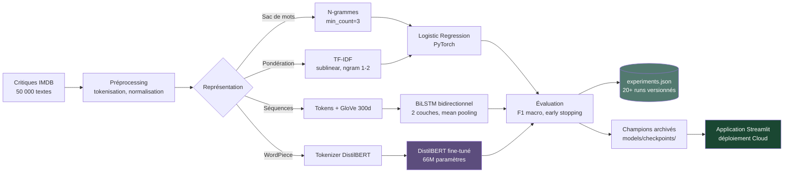

# Pipeline NLP de classification de sentiments — F1 jusqu'à 93.2

[](https://sandra-fogang-sentiment-imdb.streamlit.app/)
[](https://www.python.org/downloads/)
[](https://pytorch.org/)
[](https://huggingface.co/transformers/)
[](https://opensource.org/licenses/MIT)

> **Mots-clés** — `NLP` · `Sentiment Analysis` · `Transformers` · `DistilBERT` ·
> `BiLSTM` · `TF-IDF` · `Word Embeddings (GloVe)` · `Fine-tuning` ·
> `PyTorch` · `Hugging Face` · `Scikit-learn` · `Streamlit` · `MLOps`

Pipeline NLP complet de classification binaire de sentiments sur critiques de
films IMDB. Le projet compare systématiquement quatre paradigmes — du sac de
mots aux transformers — avec suivi rigoureux des expériences, archivage des
modèles champions et déploiement web fonctionnel.

**Modèle final retenu** : DistilBERT fine-tuné — **F1 = 93.2%** sur 3 000 critiques de validation.

---

## Démonstration en ligne

Application Streamlit interactive (modèle TF-IDF en production pour rapidité d'inférence) :
**[https://sandra-fogang-sentiment-imdb.streamlit.app/](https://sandra-fogang-sentiment-imdb.streamlit.app/)**

L'application permet de :
- Tester des critiques IMDB pré-sélectionnées (cas clairs, cas nuancés, cas difficiles incluant sarcasme)
- Coller des critiques personnalisées en anglais
- Consulter la documentation technique et la model card

---

## Table des matières

- [Aperçu et résultats clés](#aperçu-et-résultats-clés)
- [Architecture du pipeline](#architecture-du-pipeline)
- [Données](#données)
- [Comparaison des modèles](#comparaison-des-modèles)
- [Pipeline détaillé](#pipeline-détaillé)
- [Choix du modèle de production](#choix-du-modèle-de-production)
- [Apprentissages techniques](#apprentissages-techniques)
- [Limitations et model card](#limitations-et-model-card)
- [Reproductibilité](#reproductibilité)
- [Stack technique](#stack-technique)
- [Améliorations futures](#améliorations-futures)
- [Auteure](#auteure)

---

## Aperçu et résultats clés

Cette étude compare quatre familles de modèles NLP sur la même tâche de
classification de sentiments :

1. **N-grammes pondérés par occurrence** (logistic regression sur unigrammes/bigrammes)
2. **TF-IDF** (logistic regression sur features pondérées avec sublinear TF)
3. **BiLSTM bidirectionnel** initialisé avec embeddings GloVe pré-entraînés (300d)
4. **DistilBERT** (transformer pré-entraîné, fine-tuné de bout en bout)

Toutes les expériences (~20 runs) sont versionnées dans
[`outputs/experiments.json`](outputs/experiments.json), avec hyperparamètres,
métriques, et historique des pertes.


**Trois enseignements clés** :

- **Le fine-tuning est essentiel pour les transformers.** DistilBERT figé (1.5K
  paramètres entraînables) atteint seulement 85.4% F1, **en dessous des modèles
  classiques**. Fine-tuné de bout en bout (66M paramètres), il devient le
  champion à 93.2%.
- **Les modèles classiques bien calibrés restent compétitifs.** Le TF-IDF
  unigrammes+bigrammes avec `sublinear_tf` atteint 91.9% F1 — soit 1.3 point
  sous BERT, mais **20× plus léger** et **50× plus rapide en inférence**.
- **Plus de paramètres ne garantit pas de meilleurs résultats.** L'ablation du
  BiLSTM (voir plus bas) montre que doubler le `hidden_dim` et ajouter une
  seconde couche **dégrade légèrement** la performance, alors que changer le
  pooling du dernier état caché à un mean-pooling ajoute +1.2 point.

---

## Architecture du pipeline

Le projet suit une architecture modulaire séparant strictement les
responsabilités : préparation des données, modélisation, évaluation, suivi
d'expériences et déploiement.



Le pipeline complet — du chargement des données brutes à la prédiction en
production — est entièrement reproductible en moins de 5 commandes.

---

## Données

**Source** : [IMDB Large Movie Review Dataset](https://ai.stanford.edu/~amaas/data/sentiment/)
(Maas et al., 2011) — corpus public de référence pour la classification de
sentiments en anglais.

| Split | Effectif | Classes (neg / pos) |
|-------|----------|---------------------|
| Entraînement | 22 000 | 11 000 / 11 000 |
| Validation | 3 000 | 1 500 / 1 500 |
| Test (intouché) | 25 000 | 12 500 / 12 500 |

Les classes sont parfaitement équilibrées, ce qui justifie l'usage du **F1
macro** comme métrique de sélection (équivalent à l'accuracy dans ce cas, mais
plus robuste si l'équilibre changeait en production).


La longueur médiane d'une critique est d'environ 175 mots. Une longueur maximale
de **512 tokens** (en WordPiece pour BERT, en mots pour LSTM/TF-IDF) capture
~95% des critiques entièrement.

---

## Comparaison des modèles

| Modèle | Validation F1 | Validation Accuracy | Paramètres entraînables | Taille (MB) |
|--------|:-------------:|:-------------------:|:-----------------------:|:-----------:|
| Bigramme baseline (top 30k) | 0.885 | 0.885 | 30k | 5 |
| Bigramme min_count=3 | 0.906 | 0.907 | 215k | 12 |
| TF-IDF uni+bi sublinear | **0.919** | 0.920 | 243k | 12 |
| BiLSTM + GloVe 300d | 0.914 | 0.914 | 10.9M | 42 |
| DistilBERT (gelé) | 0.854 | 0.857 | 1.5k | 250 |
| **DistilBERT (fine-tuné)** | **0.932** | **0.930** | **66.4M** | 250 |

### Trade-off performance / coût


Ce trade-off guide le **choix du modèle déployé** (voir section dédiée).

### Impact du fine-tuning sur DistilBERT


Le saut de **+7.8 points** entre DistilBERT gelé et fine-tuné illustre une
leçon centrale : **un transformer pré-entraîné n'est pas immédiatement utile
sur une tâche spécifique sans adaptation des poids internes**.

### Dynamique d'entraînement de DistilBERT


DistilBERT atteint son optimum dès **l'epoch 2**. Au-delà, la train loss
continue à descendre mais la val loss remonte — signature classique du
surapprentissage sur un dataset de taille moyenne (22 000 exemples). L'early
stopping (patience 3) restaure automatiquement les meilleurs poids.

### Ablation contrôlée du BiLSTM


Cette ablation **isole l'effet de chaque modification** sur l'architecture
BiLSTM. Conclusions :
- Augmenter la capacité (hidden, couches) **n'apporte rien** sans changement
  de stratégie d'extraction
- **Le mean pooling** sur toute la séquence apporte +1.2 point sans coût
  paramétrique
- Passer de **GloVe 100d à GloVe 300d** apporte +1.1 point au prix d'un
  doublement des paramètres

Cette analyse est documentée en détail dans
[`outputs/lstm_ablation_analysis.md`](outputs/lstm_ablation_analysis.md).

---

## Pipeline détaillé

### 1. Chargement et split des données

- Téléchargement automatique du corpus IMDB via Hugging Face `datasets`
- Split stratifié reproductible (graine `RANDOM_SEED=202601`) : 22k / 3k / 25k
- Validation des proportions et de l'équilibre des classes

### 2. Préprocessing

| Modèle | Transformations |
|--------|-----------------|
| N-grammes / TF-IDF | minuscule, suppression ponctuation, tokenisation par espaces |
| BiLSTM | + construction d'un vocabulaire (top 30k mots, min_count=5) |
| DistilBERT | tokenisation WordPiece via `AutoTokenizer` (vocabulaire pré-entraîné) |

### 3. Représentation des features

- **N-grammes** : matrice de comptages
- **TF-IDF** : `TfidfVectorizer(ngram_range=(1,2), min_df=3, sublinear_tf=True)` — 243k features
- **BiLSTM** : embeddings GloVe 6B.300d initialisés (couverture 98.3%), fine-tunés pendant l'entraînement
- **DistilBERT** : embeddings WordPiece du modèle pré-entraîné, fine-tunés ou gelés selon la stratégie

### 4. Entraînement

| Aspect | Spécifications |
|--------|---------------|
| Optimiseur | Adam |
| Learning rates | 1e-3 (modèles classiques), 1e-3 (LSTM), 2e-5 (BERT fine-tuné), 5e-3 (BERT gelé) |
| Batch size | 32 (TF-IDF), 64 (LSTM), 16 (BERT 512 tokens sur T4 GPU) |
| Loss | CrossEntropyLoss |
| Early stopping | patience=3, min_delta=1e-4 |
| Sélection | F1 macro sur le set de validation |
| Hardware | CPU (modèles classiques), GPU T4 sur Colab (LSTM, BERT) |

### 5. Suivi des expériences

Chaque run est loggé automatiquement dans
[`outputs/experiments.json`](outputs/experiments.json) :

```json
{
  "name": "distilbert_full_finetune_PROD",
  "timestamp": "2026-05-04T...",
  "model": {"type": "distilbert_fine_tuned", "n_trainable_params": 66364418, ...},
  "training": {"batch_size": 16, "max_epochs": 5, "learning_rate": 2e-05, ...},
  "val_metrics": {"accuracy": 0.9303, "f1": 0.9319, ...},
  "loss_history": {...}
}
```

Cela permet la **comparaison équitable** de runs effectués à plusieurs jours
d'intervalle, sur différents hardwares.

### 6. Archivage des champions

Les meilleurs modèles de chaque paradigme sont archivés localement dans
`models/checkpoints/` :

| Fichier | Modèle | F1 |
|---------|--------|-----|
| `bigram_mincount_3.pt` + `_vocab.pkl` | n-grammes | 0.906 |
| `tfidf_uni_bi_sublinear.pt` + `_vectorizer.pkl` | TF-IDF | 0.919 |
| `bilstm_v2_full_glove300.pt` + `_vocab.pkl` | BiLSTM + GloVe | 0.914 |
| `distilbert_full_finetune.pt` + `distilbert_tokenizer/` | DistilBERT | 0.932 |

### 7. Déploiement

L'application Streamlit charge le modèle de production
(`models/classifier.pt`, qui pointe sur le TF-IDF) avec un mécanisme de
**fallback intelligent** : si le fichier de modèle est absent (premier
démarrage Streamlit Cloud), l'app entraîne automatiquement le modèle. Un
workflow GitHub Actions réveille l'application toutes les 6h pour éviter le
sleep mode du tier gratuit.

---

## Choix du modèle de production

**Modèle déployé : TF-IDF + Logistic Regression** (12 MB, F1=91.9%)

Ce choix répond à des contraintes de production réelles plutôt qu'à la maximisation
naïve d'une métrique unique :

| Critère | TF-IDF | DistilBERT fine-tuné |
|---------|:------:|:--------------------:|
| F1 score (validation) | 91.9% | **93.2%** |
| Taille du modèle | **12 MB** | 250 MB |
| Latence d'inférence (CPU) | **~10 ms** | ~500 ms |
| Mémoire au runtime | **<100 MB** | ~600 MB |
| Compatible Streamlit Cloud free | **Oui** | Non (limite 1 GB RAM) |

Le **gain de 1.3 point** apporté par BERT, bien que statistiquement significatif,
ne justifie pas un coût opérationnel **20× supérieur** dans un contexte de démo
publique gratuite. Le modèle DistilBERT reste **archivé et disponible** pour un
déploiement sur infrastructure GPU si la précision maximale devient nécessaire.

> **Citation à utiliser en entretien :** « BERT améliore la performance, mais
> TF-IDF reste compétitif pour un coût bien moindre — le choix du modèle dépend
> des contraintes de déploiement. »

---

## Apprentissages techniques

Au-delà des chiffres, ce projet a permis de valider plusieurs principes
méthodologiques :

- **Toujours établir un baseline solide.** Un bigramme bien calibré atteint 90.6%
  — la barre que tout modèle plus complexe doit franchir significativement.
- **Tester avant d'adopter.** La régularisation L2 a été testée puis **rejetée**
  car son effet était dans le bruit statistique. C'est documenté dans le
  fichier d'expériences plutôt que caché.
- **L'ablation contrôlée révèle ce qu'on n'attendait pas.** Sur le LSTM, le
  changement de pooling a apporté plus que toutes les augmentations de capacité.
- **Les graines aléatoires comptent.** Tous les runs utilisent
  `RANDOM_SEED=202601` et `TORCH_SEED=202401` pour la reproductibilité —
  vérifiée en re-exécutant le run champion BERT à plusieurs reprises.
- **Le fine-tuning n'est pas un détail.** L'écart frozen/fine-tuned (85.4 → 93.2)
  est plus grand que l'écart entre n'importe quels deux modèles classiques.

---

## Limitations et model card

### Usage prévu

Classification binaire de critiques de films **en anglais**, à des fins
éducatives ou de démonstration de pipeline NLP. Pas adapté à des décisions
automatisées en production sans validation humaine.

### Limitations connues

- **Langue unique** : entraîné uniquement sur l'anglais. Sortie aléatoire sur
  d'autres langues.
- **Domaine spécifique** : performance dégradée sur des textes hors cinéma
  (produits, services, dialogues).
- **Sarcasme et ironie** : limitation structurelle des approches sac-de-mots
  et même des transformers entraînés sur des critiques explicites. L'application
  Streamlit illustre explicitement cette limite avec des exemples.
- **Textes très courts** : moins fiable sur des messages de moins de 20 mots.
- **Biais du corpus** : IMDB est biaisé vers les critiques de films
  anglo-saxons mainstream. Performance non évaluée sur le cinéma indépendant
  international.

### Considérations éthiques

Ce modèle ne doit pas être utilisé pour des décisions automatisées affectant
des personnes (modération de contenu, scoring de feedback client en
production) sans validation humaine et audit complémentaire.

---

## Reproductibilité

```bash
# 1. Cloner et installer
git clone https://github.com/sandraFogang/nlp-sentiment-classification.git
cd nlp-sentiment-classification
pip install -r requirements.txt

# 2. Lancer l'app Streamlit (utilise le TF-IDF déjà entraîné inclus)
streamlit run app/streamlit_app.py

# 3. Re-entraîner les modèles (optionnel)
python scripts/train_champion_tfidf.py        # ~10 min CPU
python scripts/train_champion_lstm.py         # ~10 min GPU (Colab T4 recommandé)
python scripts/train_champion_bert.py         # ~30 min GPU (Colab T4 requis)

# 4. Régénérer les graphiques du README
python scripts/generate_readme_plots.py

# 5. Tests unitaires
pytest -v
```

Tous les hyperparamètres et chemins sont centralisés dans
[`src/nlp_sentiment/config.py`](src/nlp_sentiment/config.py).

---

## Stack technique

| Catégorie | Outils |
|-----------|--------|
| Langage | Python 3.12 |
| Deep learning | PyTorch 2.2+, Hugging Face Transformers, Hugging Face Datasets |
| ML classique | scikit-learn (TfidfVectorizer) |
| NLP | NLTK, GloVe (Stanford NLP) |
| Visualisation | Matplotlib |
| Application web | Streamlit |
| Tests | pytest |
| Déploiement | Streamlit Cloud, GitHub Actions (wake-up workflow) |
| Versioning | Git, GitHub |

---

## Améliorations futures

- **Évaluation finale sur le test set (25 000 critiques)** pour une métrique
  de référence non biaisée par la sélection sur le val set
- **Analyse de la latence d'inférence** mesurée précisément TF-IDF vs BERT
  sur CPU et GPU
- **Migration vers Hugging Face Spaces** pour servir DistilBERT sans contrainte
  de mémoire
- **Distillation du DistilBERT** vers un modèle <50 MB pour permettre le
  déploiement gratuit
- **Multi-classes** : extension de la classification binaire vers la prédiction
  de la note 1-10 étoiles d'IMDB
- **Détection du sarcasme** : entraînement complémentaire sur un corpus
  spécialisé (par ex. iSarcasm, SARC) pour adresser la limitation actuelle

---

## Auteure

**Sandra Desmair Fogang Lontouo**
Data Scientist · NLP · Machine Learning

[](https://github.com/sandraFogang)
[](https://www.linkedin.com/in/sandrafogang)

---

## Licence

Ce projet est distribué sous licence MIT — voir [`LICENSE`](LICENSE) pour les détails.

Données IMDB : Maas et al., 2011. *Learning Word Vectors for Sentiment Analysis*.
ACL 2011. Corpus disponible publiquement à
https://ai.stanford.edu/~amaas/data/sentiment/.