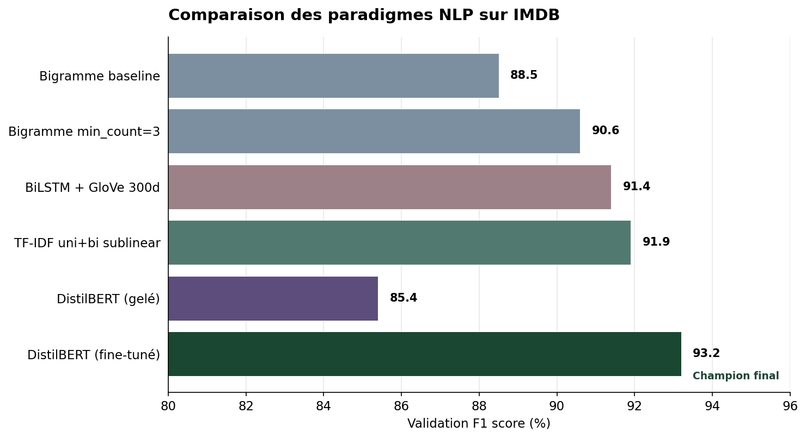
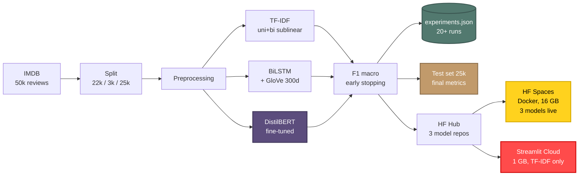
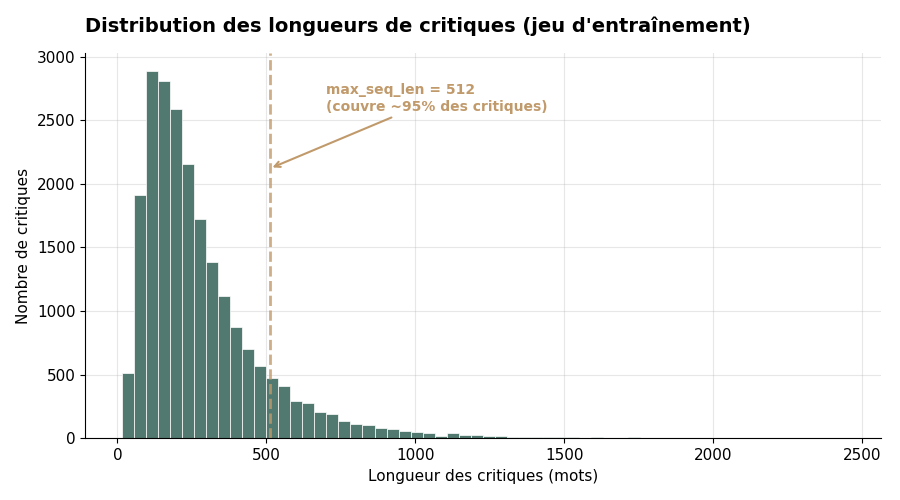
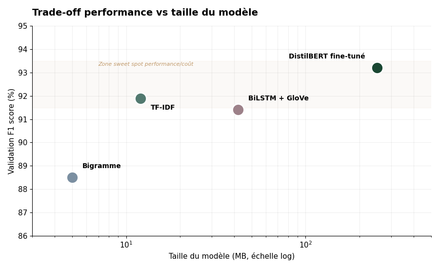
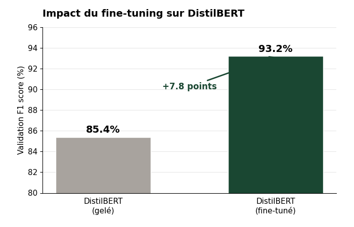
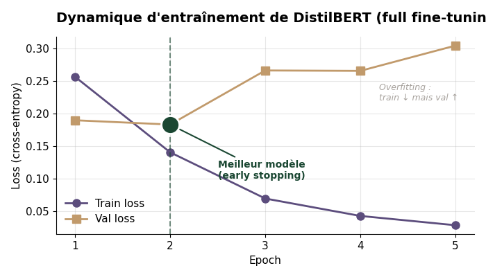
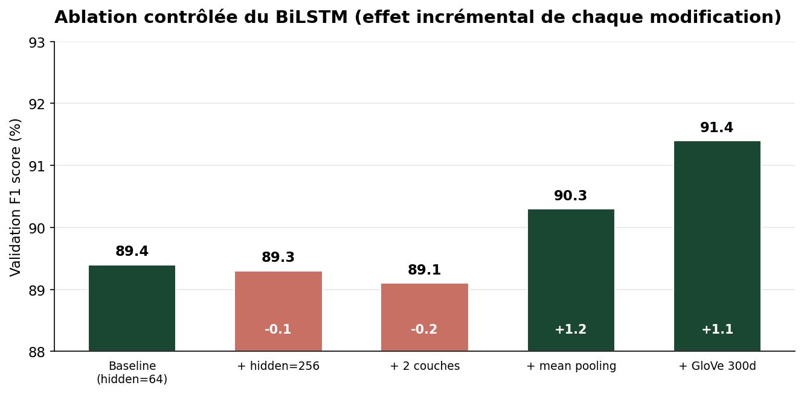
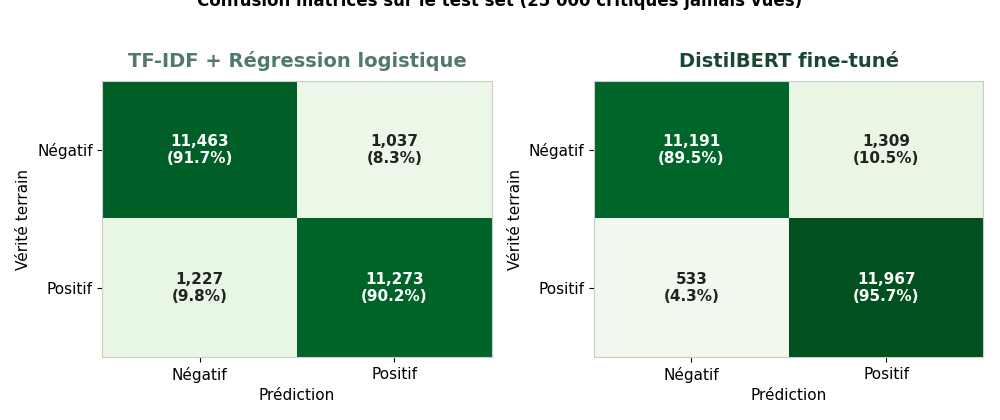
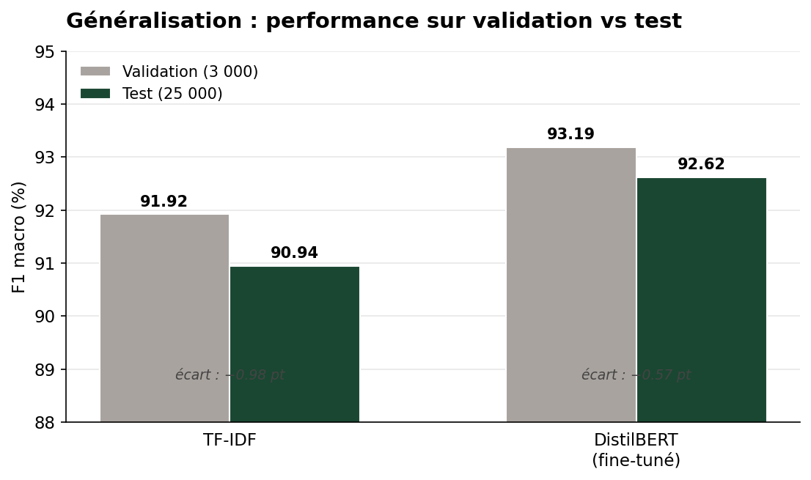

# Pipeline NLP de classification de sentiments

[-FFD21E?logo=huggingface&logoColor=black)](https://huggingface.co/spaces/sandraFogang/nlp-sentiment-analyzer)
[](https://sandra-fogang-sentiment-imdb.streamlit.app/)
[](https://www.python.org/downloads/)
[](https://pytorch.org/)
[](tests/)
[](https://opensource.org/licenses/MIT)

> > **Mots-clés** — `NLP` · `Sentiment Analysis` · `Transformers` · `DistilBERT` · `BiLSTM` · `TF-IDF` · `GloVe` · `Fine-tuning` · `Interpretability` · `Occlusion` · `PyTorch` · `scikit-learn` · `NLTK` · `Hugging Face Hub` · `Hugging Face Spaces` · `Streamlit` · `Docker` · `MLOps`

Système de classification de sentiments end-to-end comparant quatre paradigmes NLP — du sac de mots aux transformers — sur les critiques de films IMDB. Le projet couvre l'ensemble du cycle ML : exploration des données, entraînement reproductible, suivi versionné des expériences, archivage des modèles sur Hugging Face Hub, évaluation finale sur test set, interprétabilité multi-modèles, et déploiement en production d'un dashboard interactif servant trois modèles en direct.

**Modèle champion** — DistilBERT fine-tuné de bout en bout : **F1 score = 92.62 %** sur le test set IMDB officiel (25 000 critiques jamais vues durant le développement).

**Modèles déployés en live sur Hugging Face Spaces** : TF-IDF + Régression logistique · BiLSTM + GloVe 300d · DistilBERT fine-tuné.

---

## Démonstrations en ligne

Le projet est déployé sur deux plateformes complémentaires.

### [🤗 Hugging Face Spaces — version complète (3 modèles live)](https://huggingface.co/spaces/sandraFogang/nlp-sentiment-analyzer)

Les trois paradigmes (TF-IDF, BiLSTM + GloVe 300d, DistilBERT fine-tuné) sont servis en direct grâce aux 16 GB de RAM du tier gratuit HF Spaces. Les modèles sont hébergés séparément sur le Hugging Face Hub et téléchargés à la demande (lazy loading) au premier usage. Chaque modèle reste ensuite en cache pour les prédictions suivantes.

### [📊 Streamlit Cloud — déploiement secondaire](https://sandra-fogang-sentiment-imdb.streamlit.app/)

Même dashboard déployé sur Streamlit Cloud, avec le même mécanisme de lazy loading depuis Hugging Face Hub. TF-IDF reste le modèle le plus rapide (~10 ms), idéal pour une démo ponctuelle. Les trois modèles restent disponibles, à charger à la demande selon les besoins.

### Fonctionnalités du dashboard

- Quatre exemples pré-chargés couvrant des cas clairs, nuancés et difficiles (positif, négatif, sarcastique, neutre)
- Champ de saisie libre avec compteur de caractères
- Verdict en direct (POSITIF / NÉGATIF) avec score de confiance Plotly
- Probabilités softmax des deux classes côte à côte
- **Interprétabilité par modèle** : coefficients linéaires pour TF-IDF (instantané, exact), occlusion Leave-One-Out pour BiLSTM et DistilBERT
- Tableau comparatif accumulant les prédictions des trois modèles sur la même critique au fur et à mesure que l'utilisateur change de modèle
- Documentation technique et model card intégrées au dashboard

---

## Aperçu de l'application

<p align="center">
  
</p>

*Démonstration en direct sur Hugging Face Spaces : sélection des trois paradigmes (TF-IDF, BiLSTM, DistilBERT), prédictions en temps réel avec jauge de confiance, interprétabilité par occlusion, et tableau comparatif accumulant les verdicts des trois modèles sur la même critique.*

---

## Table des matières

- [Aperçu et résultats clés](#aperçu-et-résultats-clés)
- [Architecture du pipeline](#architecture-du-pipeline)
- [Modèles hébergés sur Hugging Face Hub](#modèles-hébergés-sur-hugging-face-hub)
- [Données](#données)
- [Comparaison des modèles (validation)](#comparaison-des-modèles-validation)
- [Évaluation finale sur le test set](#évaluation-finale-sur-le-test-set)
- [Interprétabilité multi-modèles](#interprétabilité-multi-modèles)
- [Pipeline détaillé](#pipeline-détaillé)
- [Choix du modèle de production](#choix-du-modèle-de-production)
- [Apprentissages techniques](#apprentissages-techniques)
- [Limitations et model card](#limitations-et-model-card)
- [Reproductibilité](#reproductibilité)
- [Stack technique](#stack-technique)
- [Améliorations futures](#améliorations-futures)
- [Auteure](#auteure)

---

## Aperçu et résultats clés

Quatre familles de modèles ont été comparées sur la même tâche, avec une méthodologie unifiée (mêmes splits, mêmes graines aléatoires, même critère de sélection F1 macro) :

1. **N-grammes pondérés par occurrence** — régression logistique sur unigrammes et bigrammes
2. **TF-IDF** — régression logistique sur features pondérées avec `sublinear_tf`
3. **BiLSTM bidirectionnel** — initialisé avec embeddings GloVe pré-entraînés (300 dimensions)
4. **DistilBERT** — transformer pré-entraîné, fine-tuné de bout en bout

L'ensemble des runs (~20) est versionné dans [`outputs/experiments.json`](outputs/experiments.json). L'évaluation finale sur le test set est consignée dans [`outputs/test_set_results.json`](outputs/test_set_results.json).

<p align="center">
  
</p>

**Trois enseignements méthodologiques** se dégagent du projet :

- **Le fine-tuning fait toute la différence pour les transformers.** Utilisé comme simple extracteur de features (poids gelés, seule la tête de classification est entraînée), DistilBERT atteint 85.4 % de F1 — soit **en dessous** des modèles classiques. Fine-tuné de bout en bout, il devient le meilleur modèle à 93.2 % sur la validation et 92.6 % sur le test.
- **Les modèles classiques bien calibrés résistent.** TF-IDF avec unigrammes, bigrammes et `sublinear_tf` atteint 91.9 % de F1 — soit 1.3 point sous BERT sur la validation, mais avec un modèle **20 fois plus léger** et environ **50 fois plus rapide en inférence**.
- **Plus de paramètres ne garantit pas de meilleurs résultats.** L'ablation contrôlée du BiLSTM (détaillée plus bas) montre que doubler la dimension cachée et ajouter une seconde couche **dégrade légèrement** la performance, alors que changer la stratégie de pooling apporte +1.2 point sans coût paramétrique.

---

## Architecture du pipeline

L'architecture suit une séparation stricte des responsabilités, du chargement des données jusqu'à la prédiction servie en production sur Hugging Face Spaces. Les modèles entraînés sont publiés sur Hugging Face Hub, puis téléchargés à la demande par l'application web.


L'ensemble du pipeline — du téléchargement des données à la prédiction servie — est reproductible en moins de cinq commandes (voir [Reproductibilité](#reproductibilité)).

---

## Modèles hébergés sur Hugging Face Hub

Les trois champions sont publiés dans des dépôts modèles dédiés sur le Hub. Chaque dépôt contient les poids `.pt` du modèle ainsi que les artefacts nécessaires à la prédiction (vectoriseur TF-IDF, vocabulaire BiLSTM, ou tokenizer DistilBERT).

| Modèle | Dépôt Hugging Face | Taille | F1 (test) |
|--------|---------------------|:------:|:---------:|
| TF-IDF + Logistic Regression | [`sandraFogang/nlp-sentiment-tfidf`](https://huggingface.co/sandraFogang/nlp-sentiment-tfidf) | 8 MB | 90.94 % |
| BiLSTM + GloVe 300d | [`sandraFogang/nlp-sentiment-bilstm`](https://huggingface.co/sandraFogang/nlp-sentiment-bilstm) | 42 MB | — |
| DistilBERT (fine-tuné) | [`sandraFogang/nlp-sentiment-distilbert`](https://huggingface.co/sandraFogang/nlp-sentiment-distilbert) | 253 MB | 92.62 % |

L'application Streamlit charge chaque modèle à la demande via `huggingface_hub.hf_hub_download()`. La librairie gère automatiquement le cache HTTP : un modèle déjà téléchargé pendant la session reste disponible instantanément. Cette stratégie de **lazy loading** permet à l'utilisateur de basculer entre les paradigmes sans saturer la RAM du Space.

```python
from huggingface_hub import hf_hub_download

weights_path = hf_hub_download(
    repo_id="sandraFogang/nlp-sentiment-distilbert",
    filename="classifier.pt",
)
```

L'upload des modèles vers le Hub est lui-même reproductible via [`scripts/upload_to_hf_hub.py`](scripts/upload_to_hf_hub.py).

---

## Données

**Source** : [IMDB Large Movie Review Dataset](https://ai.stanford.edu/~amaas/data/sentiment/) (Maas et al., 2011), corpus public de référence pour la classification de sentiments en anglais.

| Split | Effectif | Classes (négatif / positif) | Usage |
|-------|---------:|:---------------------------:|-------|
| Entraînement | 22 000 | 11 000 / 11 000 | Apprentissage des modèles |
| Validation | 3 000 | 1 500 / 1 500 | Sélection d'hyperparamètres et early stopping |
| Test | 25 000 | 12 500 / 12 500 | Évaluation finale, intouché jusqu'à la sélection définitive |

Les classes sont parfaitement équilibrées, ce qui rend le **F1 macro** quasi équivalent à l'accuracy dans ce contexte. Le F1 score reste néanmoins préférable parce qu'il deviendrait plus robuste si la distribution venait à être déséquilibrée en production.

<p align="center">
  
</p>

La longueur médiane d'une critique est de 175 mots, mais la distribution est très étirée (P95 ≈ 600 mots). DistilBERT tronque à 512 tokens WordPiece — ce seuil couvre environ 95 % des critiques sans coupure. TF-IDF traite la critique entière. Le BiLSTM applique une troncature à 200 mots à l'inférence pour limiter la latence sur CPU.

---

## Comparaison des modèles (validation)

Le tableau ci-dessous résume les performances de chaque champion sur le set de **validation** (3 000 critiques) — c'est sur cette base qu'a été conduite la sélection d'hyperparamètres. L'évaluation indépendante sur le test set est présentée dans la [section suivante](#évaluation-finale-sur-le-test-set).

| Modèle | Validation F1 | Validation Accuracy | Paramètres entraînables | Taille (MB) |
|--------|:-------------:|:-------------------:|:-----------------------:|:-----------:|
| Bigramme baseline (top 30k) | 0.885 | 0.885 | 30 k | 5 |
| Bigramme min_count=3 | 0.906 | 0.907 | 215 k | 12 |
| TF-IDF uni+bi sublinear | **0.919** | 0.920 | 243 k | 12 |
| BiLSTM + GloVe 300d | 0.914 | 0.914 | 10.9 M | 42 |
| DistilBERT (gelé) | 0.854 | 0.857 | 1.5 k | 250 |
| **DistilBERT (fine-tuné)** | **0.932** | **0.930** | **66.4 M** | 250 |

### Trade-off performance / coût

<p align="center">
  
</p>

Le graphique montre un point souvent ignoré : entre 5 MB et 250 MB de poids, on ne gagne que ~5 points de F1, et la majorité de ce gain est captée dès **12 MB** (TF-IDF). Ce trade-off justifie le choix d'avoir déployé les trois modèles plutôt qu'un seul — chaque paradigme a un usage légitime selon le contexte de production.

### Impact du fine-tuning sur DistilBERT

L'écart de performance entre DistilBERT utilisé comme simple extracteur de features (poids gelés, 1.5 k paramètres entraînables) et le même modèle fine-tuné de bout en bout est spectaculaire :

<p align="center">
  
  
</p>

Le saut de **+7.8 points** confirme une intuition forte : un transformer pré-entraîné encode du langage général, mais nécessite une adaptation des poids internes pour devenir compétitif sur une tâche spécifique. Les courbes d'entraînement à droite révèlent qu'au-delà de l'epoch 2, la train loss continue à descendre alors que la val loss remonte — signature classique du surapprentissage. L'early stopping (patience 3) restaure automatiquement les meilleurs poids.

### Ablation contrôlée du BiLSTM

Cinq variantes du BiLSTM testées séquentiellement, pour isoler l'effet de chaque levier :

<p align="center">
  
</p>

Trois conclusions intéressantes émergent :
- Augmenter la capacité (`hidden_dim` de 64 à 256, ajout d'une seconde couche) n'apporte rien en l'absence de changement plus profond
- Le passage du **dernier état caché** au **mean pooling** sur toute la séquence capture mieux le sens global de la critique (+1.2 point, sans nouveau paramètre)
- Charger des embeddings **GloVe 300d** plutôt que d'apprendre des embeddings 100d depuis zéro apporte +1.1 point — la pré-entraînement linguistique paye

Cette analyse est documentée en détail dans [`outputs/lstm_ablation_analysis.md`](outputs/lstm_ablation_analysis.md).

---

## Évaluation finale sur le test set

Une fois la sélection d'hyperparamètres figée, les deux modèles candidats au déploiement (TF-IDF et DistilBERT fine-tuné) ont été évalués **une seule fois** sur les 25 000 critiques du test set IMDB officiel, jamais utilisées durant le développement.

### Résultats finaux

| Modèle | Test F1 macro | Test Accuracy | F1 (négatif) | F1 (positif) |
|--------|:-------------:|:-------------:|:------------:|:------------:|
| TF-IDF + Régression logistique | **0.9094** | 90.94 % | 0.9101 | 0.9087 |
| **DistilBERT fine-tuné** | **0.9262** | **92.63 %** | **0.9240** | **0.9285** |

### Comportement détaillé : confusion matrices

<p align="center">
  
</p>

La comparaison côte à côte révèle un comportement très différent : **TF-IDF est quasi-symétrique** dans ses erreurs (1 037 faux positifs vs 1 227 faux négatifs), tandis que **DistilBERT est asymétrique** — il sur-classifie en positif (1 309 faux positifs contre seulement 533 faux négatifs). En pratique : BERT rate moins de critiques positives, mais signale plus de critiques négatives à tort comme positives. Cette asymétrie est documentée dans la [model card](#limitations-et-model-card) et représente une piste naturelle d'amélioration via recalibration.

### Analyse de la généralisation (val → test)

<p align="center">
  
</p>

L'écart entre validation et test mesure si la sélection d'hyperparamètres a sur-ajusté le set de validation. Pour les deux modèles, **l'écart reste sous 1 point** :

- TF-IDF : 91.92 % → 90.94 % (−0.98 pt)
- DistilBERT : 93.19 % → 92.62 % (−0.57 pt)

DistilBERT généralise légèrement mieux — un signal en faveur de la robustesse des représentations apprises par fine-tuning.

---

## Interprétabilité multi-modèles

Comprendre **pourquoi** un modèle prédit un sentiment est aussi important que sa précision. Le dashboard implémente deux méthodes d'interprétabilité, choisies selon les propriétés mathématiques de chaque architecture.

### Méthode 1 — Coefficients linéaires (TF-IDF)

Pour la régression logistique sur features TF-IDF, la contribution de chaque mot à la prédiction est calculable **exactement** et **instantanément** :

contribution(w) = tfidf(w) × (poids_positif(w) - poids_négatif(w))

Cette méthode est **déterministe**, ne nécessite aucune ré-évaluation du modèle, et capture exactement le raisonnement interne du classifieur linéaire.

### Méthode 2 — Occlusion Leave-One-Out (BiLSTM, DistilBERT)

Pour les modèles non-linéaires (LSTM, transformer), l'attribution exacte n'est pas disponible en forme close. On utilise donc une approche par **occlusion** :

1. On prédit la probabilité positive sur la critique complète (baseline)
2. Pour chaque token, on le retire de la critique et on re-prédit
3. La différence (`baseline - prédiction sans le token`) mesure l'importance du token : positive si le retrait fait baisser la confiance positive (donc le mot poussait vers positif), négative sinon

L'occlusion est plafonnée à 30 tokens par critique pour borner le coût computationnel : ~5 secondes pour BiLSTM, ~30 secondes pour DistilBERT sur CPU. L'implémentation est dans [`src/nlp_sentiment/interpretability.py`](src/nlp_sentiment/interpretability.py).

### Pourquoi pas SHAP ou LIME ?

SHAP et LIME sont des standards plus sophistiqués mais **plus lents** (10-30 secondes par prédiction même pour TF-IDF) et difficiles à servir en CPU-only. La combinaison **coefficients exacts + occlusion bornée** offre un compromis raisonnable : interprétabilité instantanée pour le modèle léger déployé, interprétabilité acceptable (5-30 s) pour les modèles plus lourds.

Une migration vers SHAP est listée dans les [améliorations futures](#améliorations-futures).

---

## Pipeline détaillé

### 1. Chargement et split des données

- Téléchargement automatique du corpus via Hugging Face `datasets`
- Split stratifié reproductible (`RANDOM_SEED=202601`)
- Vérification systématique des proportions et de l'équilibre des classes

### 2. Préprocessing

| Modèle | Transformations |
|--------|-----------------|
| N-grammes / TF-IDF | minuscule, suppression ponctuation, tokenisation par espaces |
| BiLSTM | + construction d'un vocabulaire (top 30 k mots, min_count=5) |
| DistilBERT | tokenisation WordPiece via `AutoTokenizer` (vocabulaire pré-entraîné) |

### 3. Représentation des features

- **N-grammes** : matrice creuse de comptages
- **TF-IDF** : `TfidfVectorizer(ngram_range=(1,2), min_df=3, sublinear_tf=True)` — 243 k features
- **BiLSTM** : embeddings GloVe 6B.300d initialisés (couverture du vocabulaire 98.3 %), continués pendant l'entraînement
- **DistilBERT** : embeddings WordPiece du modèle pré-entraîné, gelés ou fine-tunés selon la stratégie

### 4. Entraînement

| Aspect | Spécifications |
|--------|---------------|
| Optimiseur | Adam |
| Learning rates | 1e-3 (TF-IDF, LSTM), 2e-5 (BERT fine-tuné), 5e-3 (BERT gelé) |
| Batch size | 32 (TF-IDF), 64 (LSTM), 16 (BERT 512 tokens sur GPU T4) |
| Loss | CrossEntropyLoss |
| Early stopping | patience 3, min_delta 1e-4 |
| Critère de sélection | F1 macro sur la validation |
| Hardware | CPU (modèles classiques), GPU T4 sur Colab (LSTM, BERT) |

### 5. Suivi des expériences

Chaque run alimente automatiquement [`outputs/experiments.json`](outputs/experiments.json) avec hyperparamètres, métriques et historique des pertes :

```json
{
  "name": "distilbert_full_finetune_PROD",
  "model": {"type": "distilbert_fine_tuned", "n_trainable_params": 66364418},
  "training": {"batch_size": 16, "max_epochs": 5, "learning_rate": 2e-05},
  "val_metrics": {"accuracy": 0.9303, "f1": 0.9319},
  "loss_history": {...}
}
```

Cela permet la comparaison équitable de runs effectués à plusieurs jours d'intervalle, sur différents hardwares.

### 6. Archivage et publication des champions

Les meilleurs modèles de chaque paradigme sont archivés en deux endroits : **localement** dans `models/checkpoints/` (pour la reproductibilité), et **publiquement** sur le Hugging Face Hub (pour le déploiement web).

| Modèle | Validation F1 | HF Hub |
|--------|:-------------:|--------|
| Bigramme min_count=3 | 0.906 | (non publié — baseline interne) |
| TF-IDF uni+bi sublinear | 0.919 | [✓ tfidf](https://huggingface.co/sandraFogang/nlp-sentiment-tfidf) |
| BiLSTM + GloVe 300d | 0.914 | [✓ bilstm](https://huggingface.co/sandraFogang/nlp-sentiment-bilstm) |
| DistilBERT (fine-tuné) | 0.932 | [✓ distilbert](https://huggingface.co/sandraFogang/nlp-sentiment-distilbert) |

### 7. Déploiement multi-plateformes

L'application Streamlit est déployée sur **deux plateformes** ciblant des contraintes différentes :

| Plateforme | Hardware | Modèles servis | Cas d'usage |
|------------|----------|----------------|-------------|
| Hugging Face Spaces | Docker, 16 GB RAM, CPU | 3 modèles (lazy loaded) | Démo complète, comparaison interactive |
| Streamlit Cloud | 1 GB RAM, CPU | 3 modèles via lazy loading HF Hub | Déploiement secondaire, focus TF-IDF |

Sur HF Spaces, la conteneurisation est gérée par un [`Dockerfile`](Dockerfile) qui expose Streamlit sur le port 7860 (convention HF). Sur Streamlit Cloud, un workflow GitHub Actions ping l'application toutes les 6 heures pour éviter le sleep mode du tier gratuit.

---

## Choix du modèle de production

Le choix du modèle dépend du contexte de déploiement. Plutôt que de servir un seul modèle, le projet expose les **trois paradigmes en parallèle** sur HF Spaces, ce qui permet à l'utilisateur final de comparer en direct leur comportement sur la même critique.

| Critère | TF-IDF | BiLSTM + GloVe | DistilBERT fine-tuné |
|---------|:------:|:--------------:|:--------------------:|
| F1 sur le test set | 90.94 % | — | **92.62 %** |
| Taille du modèle | **8 MB** | 42 MB | 253 MB |
| Latence d'inférence (CPU) | **~10 ms** | ~150 ms | ~500 ms |
| Mémoire au runtime | <100 MB | ~250 MB | ~600 MB |
| Compatible Streamlit Cloud (lazy loading) | ✅ | ✅ | ✅ (sous surveillance mémoire) |
| Servi sur HF Spaces | ✅ | ✅ | ✅ |

**Recommandations selon le contexte** :

- **Production sous contrainte forte (mobile, edge, low-cost cloud)** : TF-IDF reste le meilleur compromis. L'écart de 1.7 point avec BERT ne justifie généralement pas un coût opérationnel ~20× supérieur.
- **Production où la précision compte plus que le coût (modération de contenu, aide à la décision médicale)** : DistilBERT fine-tuné, avec recalibration préalable pour corriger l'asymétrie observée sur le test set.
- **Cas hybride (ex. cinéma, e-commerce)** : BiLSTM peut offrir un compromis intéressant, en particulier pour des textes courts à moyens.

> **Position défendable en entretien :** « Le choix du modèle dépend des contraintes de déploiement. BERT améliore la performance, mais TF-IDF reste très compétitif pour un coût bien moindre. Servir les trois en parallèle rend ce trade-off tangible pour l'utilisateur final. »

---

## Apprentissages techniques

Au-delà des chiffres, plusieurs principes ont été confirmés au cours du projet :

- **Établir un baseline solide est non négociable.** Un bigramme bien calibré atteint 90.6 % — la barre que tout modèle plus complexe doit franchir significativement pour mériter sa complexité.
- **Tester avant d'adopter.** La régularisation L2 a été testée puis **rejetée** (effet dans le bruit statistique). Plutôt que de balayer ce résultat, il est documenté dans `experiments.json`.
- **L'ablation contrôlée révèle ce qu'on n'aurait pas deviné.** Sur le LSTM, le changement de stratégie de pooling apporte plus que toutes les augmentations de capacité réunies.
- **Le fine-tuning n'est pas un détail.** L'écart frozen / fine-tuned (85.4 → 93.2) est plus grand que l'écart entre n'importe quels deux modèles classiques de l'étude.
- **L'évaluation finale sur test set est non-négociable.** Toutes les performances annoncées dans une présentation, un CV ou un README devraient toujours être les chiffres test, pas les chiffres validation.
- **Le déploiement multi-modèles a une valeur pédagogique.** Servir les trois paradigmes en parallèle force l'utilisateur (et le développeur) à confronter les divergences — un cas où les trois modèles donnent des verdicts différents est plus instructif que n'importe quel benchmark agrégé.
- **Reproductibilité = graines fixées + dépendances pinnées + Dockerfile.** Tous les runs utilisent `RANDOM_SEED=202601` et `TORCH_SEED=202401`. L'environnement de déploiement HF Spaces est entièrement reproductible via un Dockerfile minimal de 14 lignes.

---

## Limitations et model card

### Usage prévu

Classification binaire de critiques de films **en anglais**, à des fins éducatives ou de démonstration de pipeline NLP. **Pas adapté** à des décisions automatisées en production sans validation humaine.

### Limitations connues

- **Langue unique** — les modèles n'ont vu que de l'anglais. Leur sortie sur d'autres langues est essentiellement aléatoire (TF-IDF) ou mécaniquement biaisée par le tokenizer pré-entraîné (BERT).
- **Domaine spécifique** — performance dégradée en dehors du cinéma (produits, services, conversations). Le vocabulaire et le style des critiques IMDB sont reconnaissables.
- **Sarcasme et ironie** — limitation structurelle des approches sac-de-mots *et* des transformers entraînés uniquement sur des critiques explicites. L'application illustre cette limite avec un exemple où le modèle prédit positif à plus de 95 % sur une critique en réalité négative et ironique.
- **Asymétrie de DistilBERT** — le modèle a tendance à être plus prudent à prédire « négatif » qu'à prédire « positif » (1 309 faux positifs contre 533 faux négatifs sur le test set). À considérer selon le coût relatif des deux types d'erreurs dans un cas d'usage réel.
- **Textes très courts** — moins fiable sur des messages de moins de 20 mots.
- **Biais du corpus** — IMDB sur-représente les critiques de films anglo-saxons mainstream. Performance non évaluée sur le cinéma indépendant international.

### Considérations éthiques

Ces modèles ne doivent pas être utilisés pour des décisions automatisées affectant des personnes (modération de contenu, scoring de feedback client, recommandations) sans validation humaine et audit complémentaire des biais.

---

## Reproductibilité

```bash
# 1. Cloner et installer
git clone https://github.com/sandraFogang/nlp-sentiment-classification.git
cd nlp-sentiment-classification
pip install -e .

# 2. Lancer l'application Streamlit (3 modèles via HF Hub)
python -m streamlit run app/streamlit_app.py

# 3. Re-entraîner les modèles localement (optionnel)
python scripts/train_champion_tfidf.py        # ~10 min CPU
python scripts/train_champion_lstm.py         # ~10 min GPU (Colab T4)
python scripts/train_champion_bert.py         # ~30 min GPU (Colab T4)

# 4. Re-évaluer sur le test set (les deux modèles candidats)
python scripts/evaluate_on_test.py

# 5. Régénérer les graphiques du README
python scripts/generate_readme_plots.py

# 6. Lancer les tests unitaires
pytest -v

# 7. Re-uploader les modèles sur HF Hub (si réentraînés)
hf auth login
python scripts/upload_to_hf_hub.py
```

Tous les hyperparamètres et chemins sont centralisés dans [`src/nlp_sentiment/config.py`](src/nlp_sentiment/config.py).

L'environnement de déploiement HF Spaces est entièrement défini par le [`Dockerfile`](Dockerfile) à la racine du projet — n'importe qui peut forker le repo et déployer une copie indépendante de la démo en moins de 10 minutes.

---

## Stack technique

| Catégorie | Outils |
|-----------|--------|
| Langage | Python 3.12 |
| Deep learning | PyTorch 2.2+, Hugging Face Transformers |
| ML classique | scikit-learn (TfidfVectorizer, métriques) |
| NLP | NLTK, GloVe (Stanford NLP), Hugging Face Datasets |
| Visualisation | Matplotlib (rapports), Plotly (dashboard interactif) |
| Application web | Streamlit |
| Hébergement modèles | Hugging Face Hub (3 dépôts dédiés) |
| Hébergement application | Hugging Face Spaces (Docker), Streamlit Cloud |
| Conteneurisation | Docker (image Python 3.11-slim) |
| Tests | pytest |
| CI/CD | GitHub Actions (wake-up workflow) |
| Versioning | Git, GitHub |

---

## Améliorations futures

- **Recalibration de DistilBERT** pour corriger l'asymétrie observée sur le test set (Platt scaling ou isotonic regression). L'objectif serait de ramener le ratio faux-positifs / faux-négatifs proche de 1.
- **Distillation du modèle BERT** vers une version sous 50 MB compatible avec un déploiement Streamlit Cloud sans contrainte mémoire.
- **Migration de l'occlusion vers SHAP ou Integrated Gradients** pour une interprétabilité plus fidèle au comportement interne des modèles non-linéaires.
- **Mesure précise de la latence d'inférence** TF-IDF vs BiLSTM vs DistilBERT sur CPU et GPU selon `max_seq_len`, avec benchmarks reproductibles.
- **Extension multi-classes** — prédiction de la note 1-10 d'IMDB plutôt que classification binaire, ce qui permettrait des cas d'usage de recommandation plus fins.
- **Détection du sarcasme** — entraînement complémentaire sur un corpus spécialisé (iSarcasm, SARC) pour adresser la principale limitation actuelle des trois modèles.
- **Cohérence train/inference du BiLSTM** — actuellement entraîné sur des critiques entières mais tronqué à 200 mots à l'inférence. Aligner les deux (par ex. troncature à 512 mots à l'inférence, ou réentraînement avec la même limite) pour garantir la performance maximale en production.

---

## Auteure

**Sandra Desmair Fogang Lontouo**
Data Scientist · NLP · Machine Learning

[](https://github.com/sandraFogang)
[](https://www.linkedin.com/in/sandrafogang)
[](https://huggingface.co/sandraFogang)

---

## Licence

Ce projet est distribué sous licence MIT — voir [`LICENSE`](LICENSE).

Données IMDB : Maas et al. (2011), *Learning Word Vectors for Sentiment Analysis*, ACL 2011. Corpus disponible publiquement sur https://ai.stanford.edu/~amaas/data/sentiment/.